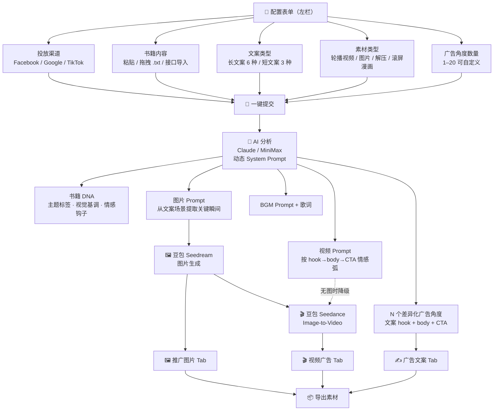

# 📚 Book Promo Studio

书籍推广素材一站式生成 — 输入书籍内容，一键生成差异化广告图片、视频、文案

## 📊 工作流程



## ✨ 核心功能

### 配置项（左栏表单，一次性提交）
| 配置 | 选项 |
|---|---|
| **投放渠道** | Facebook / Google / TikTok |
| **书籍内容** | 粘贴文本 / 拖拽 .txt 文件 / 接口导入（即将上线） |
| **文案类型** | 长文案（POV剧情 / 普通剧情 / 口播剧情 / 对话流 / 分镜脚本 / 种草推书）<br>短文案（评论弹幕 / 单句爆点 / 模拟信息） |
| **素材类型** | 轮播视频 / 轮播图片 / 解压 / 滚屏漫画 |
| **广告角度数量** | 1 / 2 / 3 / 5 / 8，或自定义（1-20） |
| **AI 模型** | MiniMax / Claude |

### 生成能力（右栏 Tab 查看）
- **广告文案** — AI 生成 hook + body + CTA，格式与文案类型严格匹配
- **推广图片** — 豆包 Seedream，与文案场景强绑定的图片提示词
- **视频广告** — 豆包 Seedance，支持图片→视频（image-to-video）

### 一键生成全部
先串行生成所有角度的图片，再用生成好的图片作为首帧提交视频任务（image-to-video），使图片与视频风格一致。

## 🔧 技术栈

| 环节 | 服务 |
|---|---|
| 文本分析 & 提示词生成 | **Claude** / **MiniMax** |
| 图片生成 | **豆包 Seedream**（字节跳动） |
| 视频生成 | **豆包 Seedance**（text-to-video & image-to-video） |
| 语音合成 | **MiniMax Speech-02-HD** |
| 状态管理 | Zustand |
| 框架 | Next.js 15 App Router |

## 🚀 快速开始

```bash
cp .env.example .env.local
# 填入以下 API Key
npm install
npm run dev
```

打开 http://localhost:3001

## � 需要的 API Key

```env
ANTHROPIC_API_KEY=     # https://console.anthropic.com
MINIMAX_API_KEY=       # https://platform.minimaxi.com
DOUBAO_API_KEY=        # 豆包（字节跳动）https://ark.cn-beijing.volces.com
```

## 📁 项目结构

```
src/
├── app/
│   ├── api/
│   │   ├── analyze/          # AI 分析书籍，生成差异化角度
│   │   └── generate/
│   │       ├── image/        # 豆包 Seedream 图片生成
│   │       ├── video/        # 豆包 Seedance 视频生成（支持 image-to-video）
│   │       └── audio/        # MiniMax TTS 语音合成
│   ├── components/
│   │   ├── ConfigForm.tsx    # 左栏：一次性配置表单
│   │   ├── KeywordPanel.tsx  # 书籍 DNA 展示
│   │   ├── PromptPanel.tsx   # 广告文案展示
│   │   ├── AssetGallery.tsx  # 图片画廊（含图→视频按钮）
│   │   ├── VideoGallery.tsx  # 视频画廊
│   │   └── ExportButton.tsx  # 导出
│   └── page.tsx              # 主页面（左右两栏布局）
└── lib/
    ├── claude.ts             # LLM 封装 & 动态 System Prompt
    └── store.ts              # Zustand 全局状态
```

## 🧠 提示词工程

`buildSystemPrompt()` 根据用户选择动态生成系统提示词，注入三层规则：

1. **渠道规则** — 受众心态、文案风格、语言节奏
2. **文案类型规则** — 格式要求（如分镜脚本加 [Shot N] 序号 + 时长）
3. **素材类型规则** — image_prompt / video_prompt 格式（如滚屏漫画用 9:16 竖版分格）

**视觉-文案绑定**：AI 在生成 image_prompt / video_prompt 前，必须先从当前角度的 copywriting 中提取关键场景、主角状态和冲突核心，确保视觉与文案严格对应。
